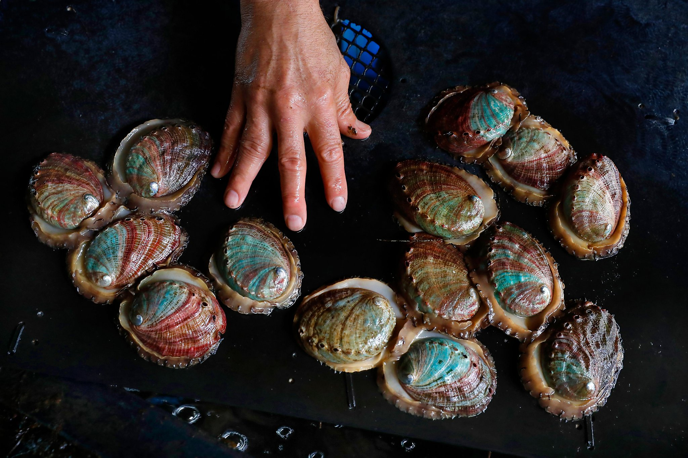

```{r setup, include=FALSE}
knitr::opts_chunk$set(echo = F)
knitr::opts_knit$set(root.dir = rprojroot::find_rstudio_root_file())

```

```{r, include=FALSE}
  source('scripts/utils.R')
  load_libs()
  load_config('abalone_cs.R')
  
  dir_input <- paste0('data/raw/', input)
  raw <- fread(dir_input)
```

## Abalone Age Prediction

Predicting the age of abalone from physical measurements. The age of abalone is determined by cutting the shell through the cone, staining it, and counting the number of rings through a microscope – a boring and time-consuming task. Other measurements, which are easier to obtain, are used to predict the age.

[UCI Data Set Link](https://archive.ics.uci.edu/ml/datasets/Abalone)

```{r image, echo=FALSE, fig.cap="", out.width = '100%'}

```


## Basic description
```{r}
intro <- introduce(raw)
kable(intro) %>% kable_styling(full_width = F, position = "left")

plot_intro(raw)
```

### Missing Values
```{r}
if(intro$total_missing_values == 0) cat('No missing values') else plot_missing(raw)
```

### Frequency distribution of all discrete variables
```{r}
## Left: frequency distribution of all discrete variables
plot_bar(raw)
```

### Frequency distribution of all discrete variables
```{r}
## Left: frequency distribution of all discrete variables
plot_histogram(raw)
```

### QQ Plot

Quantile-Quantile plot is a way to visualize the deviation from a specific probability distribution. After analyzing these plots, it is often beneficial to apply mathematical transformation (such as log) for models like linear regression. To do so, we can use plot_qq function. By default, it compares with normal distribution.

Note: The function will take a long time with many observations, so you may choose to specify an appropriate sampled_rows
```{r}
plot_qq(raw, sampled_rows = 1000)
```

### Correlation
```{r}
plot_correlation(raw, type = "c")
plot_correlation(raw, type = "d")
```

### Principle Component Analysis
```{r}
plot_prcomp(raw, variance_cap = 0.95)
```

### Boxplot by Rings
```{r}
plot_boxplot(raw, by = "Rings")
```

### Scatterplot by Rings
```{r}
plot_scatterplot(raw, by = "Rings", sampled_rows = 1000)
```


```{r}
# max_ppm <- data.frame(agg_max_ppm$max_ppm)
# names(max_ppm) <- 'Summary'
# 
# kable(summary(max_ppm), col.names = 'Summary') %>% kable_styling(full_width = F, position = "left")
```